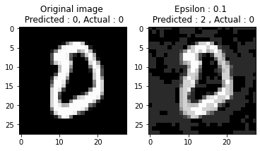
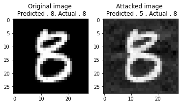

# Adversarial Attack on Image Data using PyTorch

## About the Project

Adversarial attacks on image data are a type of machine learning (ML) attack that involves subtly modifying an image to trick a model into making an incorrect prediction.

In this project I implement two types of attacks on MNIST dataset using PyTorch which are implemented based on the following papers:

1. FGSM - [Link to paper](https://arxiv.org/abs/1412.6572)
2. Deepfool Attack - [Link to paper](https://arxiv.org/abs/1511.04599)

Results:

FGSM
  

Deepfool Attack
  

MNIST Dataset
  

